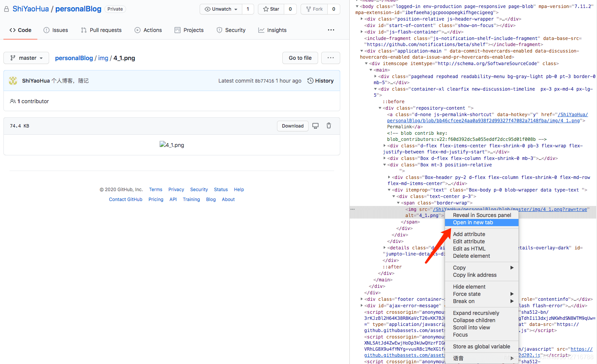
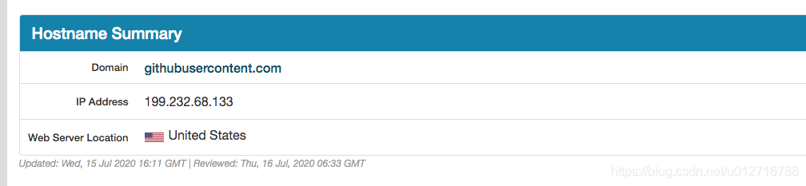

# 解决github图片不显示的问题

### 主要思路解决方法如下：

就是使用本地hosts文件对网站进行域名解析，一般的DNS问题都可以通过修改hosts文件来解决，github的CDN域名被污染问题也不例外，同样可以通过修改hosts文件解决，将域名解析直接指向IP地址来绕过DNS的解析，以此解决污染问题。

### 1、找到GitHub上图片的域名

使用Google浏览器，右击”检查“，

点击”open in new tab“ 打开图片链接： https://raw.githubusercontent.com/ShiYaoHua/personalBlog/master/img/4_1.png?token=ABXPYHXNV4IM43QWY5V52CS7CAAHE

复制域名：raw.githubusercontent.com

### 2、[到IPAddress.com网站](https://www.ipaddress.com/)

[复制域名进去解析ip地址：199.232.68.133](https://www.ipaddress.com/)

### 3、修改hosts

前往文件夹 /etc 打开hosts文件 添加

199.232.68.133 raw.githubusercontent.com

