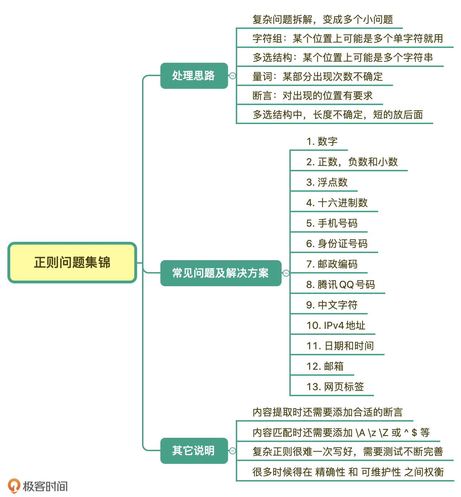

# 问题处理思路

* 某个位置上可能有多个字符的话，就⽤字符组。

* 某个位置上有多个字符串的话，就⽤多选结构。

* 出现的次数不确定的话，就⽤量词。

* 对出现的位置有要求的话，就⽤锚点锁定位置。

* 某些字符不能出现，这个情况又可以进一步分为组成中不能出现，和要查找的内容前后不能出现。后一种用环视来解决就可以了。
  * 如果是要查找的内容中不能出现某些字符，这种情况比较简单，可以通过使用中括号来排除字符组，比如非元音字母可以使用 \[^aeiou]来表示。
  * 如果是内容中不能出现某个子串，比如要求密码是 6 位，且不能有连续两个数字出现。假设密码允许的范围是 \w，你应该可以想到使用 \w{6} 来表示 6 位密码，但如果里面不能有连续两个数字的话，该如何限制呢？这个可以环视来解决，就是每个字符的后面都不能是两个数字（要注意开头也不能是 \d\d）
* 在写完正则后，我们可以通过一些工具去调试，先要确保正则满足功能需求，再看一下有没有性能问题， 如果功能不正确，性能考虑再多其实也没用。

