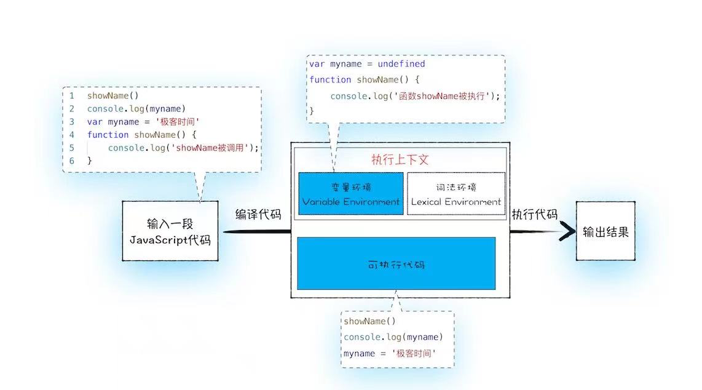
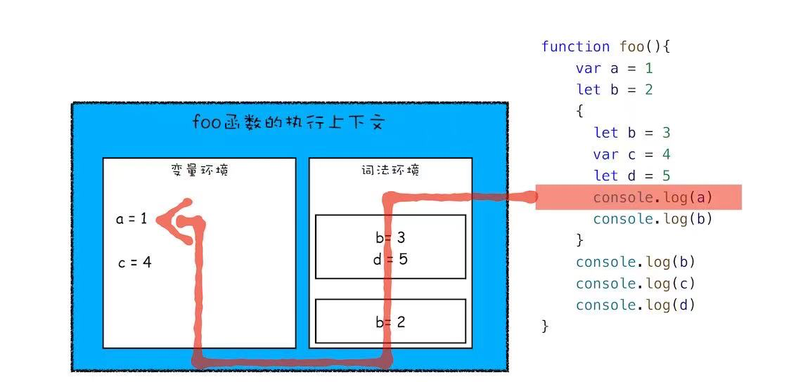

##### 来自w3c

1. HTML是一门编程语言。【错误，是一种标记语言，超文本标记语言 (Hyper Text Markup Language)】

2. HTML 标题标签一共有7个【错误，最小的标题标签是h6】

3. 默认情况下，HTML 会自动地在块级元素前后添加一个额外的空行，比如段落、标题元素前后。【对】块级元素在浏览器显示时，通常会以新行来开始（和结束）

4. 对于 HTML，无法通过在 HTML 代码中添加额外的空格或换行来改变输出的效果。【对】

   

##### 来自工作经验

1. 实现一个节流函数

   ```javascript
   export function throttle(_this, func, ...params) {
   
     if (!_this.previous) {
       _this.previous = 0;
     }
   
     const now = Date.now();
     if (now - _this.previous > 1500) {
       func.apply(_this, params);
       _this.previous = now;
     }
   
   }
   ```

2. webpack 相关知识点

   * loader： 让 webpack 能够去处理那些非 JavaScript 文件（webpack 自身只理解 JavaScript）

   * plugins：loader 被用于转换某些类型的模块，而插件则可以用于执行范围更广的任务。插件的范围包括，从打包优化和压缩，一直到重新定义环境中的变量。[插件接口](https://www.webpackjs.com/api/plugins)功能极其强大，可以用来处理各种各样的任务。

   * ES2015 中的 import 和 export 语句已经被标准化。虽然大多数浏览器还无法支持它们，但是 webpack 却能够提供开箱即用般的支持。

   * 通过向 npm run build 命令和你的参数之间添加两个中横线，可以将自定义参数传递给 webpack，例如：npm run build -- --colors。 [但是怎么获取呢]

   * 在命令行中运行 npm run watch，就会看到 webpack 编译代码，然而却不会退出命令行。这是因为 script 脚本还在观察文件

     

##### 来自浏览器工作原理与实践

1. <u>浏览器工作流程『从输入 URL 到页面展示』</u>

   * <u>用户输入</u>
     + <u>用户在地址栏按下回车，检查输入（关键字 or 符合 URL 规则），组装完整 URL</u>
     + <u>回车前，当前页面执行 onbeforeunload 事件</u>
     + <u>浏览器进入加载状态</u>
   * <u>URL 请求</u>
     * <u>浏览器进程通过 IPC 把 URL 请求发送至网络进程</u>
     * <u>查找资源缓存（有效期内）</u>
     * <u>DNS 解析（查询 DNS 缓存）</u>
     * <u>进入 TCP 队列（单个域名 TCP 连接数量限制）</u>
     * <u>创建 TCP 连接（三次握手）</u>
     * <u>HTTPS 建立 TLS 连接（client hello, server hello, pre-master key 生成『对话密钥』）</u>
     * <u>发送 HTTP 请求（请求行[方法、URL、协议]、请求头 Cookie 等、请求体 POST）</u>
     * <u>接受请求（响应行[协议、状态码、状态消息]、响应头、响应体等）</u>
       * <u>状态码 301 / 302，根据响应头中的 Location 重定向</u>
       * <u>状态码 200，根据响应头中的 Content-Type 决定如何响应（下载文件、加载资源、渲染 HTML）</u>
   * <u>准备渲染进程</u>
     * <u>根据是否同一站点（相同的协议和根域名），决定是否复用渲染进程</u>
   * <u>提交文档</u>
     * <u>浏览器进程接受到网路进程的响应头数据，向渲染进程发送『提交文档』消息</u>
     *  <u>渲染进程收到『提交文档』消息后，与网络进程建立传输数据『管道』</u>
     * <u>传输完成后，渲染进程返回『确认提交』消息给浏览器进程</u>
     * <u>浏览器接受『确认提交』消息后，移除旧文档、更新界面、地址栏，导航历史状态等</u>
     * <u>此时标识浏览器加载状态的小圆圈，从此前 URL 网络请求时的逆时针选择，即将变成顺时针旋转（进入渲染阶段）</u>
   * <u>渲染</u>
     * <u>构建 DOM 树</u>
       * <u>输入：HTML 文档</u>
       * <u>处理：HTML 解析器解析</u>
       * <u>输出：DOM 数据解构</u>
     * <u>样式计算</u>
       * <u>输入：CSS 文本</u>
       * <u>处理：属性值标准化，每个节点具体样式（继承、层叠）</u>
       * <u>输出：styleSheets(CSSOM)</u>
     * <u>布局(DOM 树中元素的计划位置)</u>
       * <u>DOM & CSSOM 合并成渲染树</u>
       * <u>布局树（DOM 树中的可见元素）</u>
       * <u>布局计算</u>
     * <u>分层</u>
       * <u>特定节点生成专用图层，生成一棵图层树（层叠上下文、Clip，类似 PhotoShop 里的图层）</u>
       * <u>拥有层叠上下文属性（明确定位属性、透明属性、CSS 滤镜、z-index 等）的元素会创建单独图层</u>
       * <u>没有图层的 DOM 节点属于父节点图层</u>
       * <u>需要剪裁的地方也会创建图层</u>
     * <u>绘制指令</u>
       * <u>输入：图层树</u>
       * <u>渲染引擎对图层树中每个图层进行绘制</u>
       *  <u>拆分成绘制指令，生成绘制列表，提交到合成线程</u>
       * <u>输出：绘制列表</u>
     * <u>分块</u>
       * <u>合成线程会将较大、较长的图层（一屏显示不完，大部分不在视口内）划分为图块（tile, 256*256, 512*512）</u>
     * <u>光栅化（栅格化）：</u>
       * <u>在光栅化线程池中，将视口附近的图块优先生成位图（栅格化执行该操作）</u>
       * <u>快速栅格化：GPU 加速，生成位图（GPU 进程）</u>
     * <u>合成绘制</u>
       * <u>绘制图块命令——DrawQuad，提交给浏览器进程</u>
       * <u>浏览器进程的 viz 组件，根据DrawQuad命令，绘制在屏幕上</u>
     * <u>部分概念解释</u>
       * <u>重排</u>
         * <u>更新了元素的几何属性（如宽、高、边距）</u>
         * <u>触发重新布局，解析之后的一系列子阶段</u>
         * <u>更新完成的渲染流水线，开销最大</u>
       * <u>重绘</u>
         * <u>更新元素的绘制属性（元素的颜色、背景色、边框等）</u>
         * <u>布局阶段不会执行（无几何位置变换），直接进入绘制阶段</u>
       * <u>合成</u>
         * <u>直接进入合成阶段（例如CSS 的 transform 动画）</u>
         * <u>直接执行合成阶段，开销最小</u>

2. 使用 [n](https://github.com/tj/n)，[nvm](https://github.com/creationix/nvm) 或 [nvm-windows](https://github.com/coreybutler/nvm-windows) 在可以在同一台电脑中管理多个 Node 版本。

3. 变量提升【js代码编译过程中，将变量的声明和函数的声明提升到代码开头的行为，提升后初始化为undefined】

   * 在执行过程中，若使用了未声明的变量，那么 JavaScript 执行会报错。
   * 在一个var变量定义之前使用它，不会出错，但是该变量的值会为 undefined，而不是定义时的值。
   * 在一个函数定义之前使用它，不会出错，且函数能正确执行。

4. 执行上下文

   

   如图，编译后会有两部分，执行上下文和可执行代码。执行上下文即执行一段代码的运行环境。函数执行完毕，创建的函数执行上下文就会被销毁。

5. 调用栈【管理函数调用关系的一种数据结构】

   * 控制面板 - source - call stack 可以查看

6. ES6引入块级作用域+let, const 关键词解决变量提升问题

   * 作用域：程序中定义变量的区域，该位置决定了变量的生命周期。通俗即控制了变量和函数的可访问范围

   * 全局作用域：生命周期跟随页面的生命周期，代码中的任何位置都可以访问

   * 函数作用域：函数内部定义的变量或者函数，并且定义的变量或者函数只能在函数内部被访问，函数执行结束后，函数内部定义的变量会被销毁

   * 块作用域：ES6之前没有。在没有的情况下，将变量提升是极好的设计。但是变量提升容易出现变量在不被察觉的情况下被覆盖，全量变量容易被污染，以及本应该被销毁的变量没有被销毁。

     ```javascript
     var myName = 'abc'
     function showName() {
       console.log(myName);
       if(0) {
         var myName = 'a'
       }
       console.log(myName)
     }
     showName(); // undefined 获取的是 showName 函数执行上下文中被变量提升的 myName
     ```

     ```javascript
     function foo() {
       for (var i = 0; i < 7; i++) {}
       console.log(i)
     }
     foo(); // 7 for循环结束后，i没有被销毁
     ```

   

   函数内部通过var 声明的变量，编译阶段在变量环境中。通过let， const声明的变量，编译阶段放到词法环境中。其中，函数的作用域块内部的let声明，没有被存放到词法环境中。

   执行阶段，当执行到函数的作用域块的时候，该作用域块内的let声明会存放在词法环境中另外的一个单独的区域，不影响该作用域块外的变量，实现了一个小型的栈结构。

   执行阶段寻找变量，如图所示的箭头顺序查找。执行完块作用域后，内部定义的变量会从词法环境中弹出。

   ```javascript
   function foo() {
     var a = 1;
     let b = 2;
     {
       let b = 3;
       var c = 4;   
       let d = 5;
       console.log(a) // 1
       console.log(b) // 3
     }
     console.log(b) // 2
     console.log(c) // 4
     console.log(d) // Uncaught ReferenceError: d is not defined
   }
   ```

   思考：

   ```javascript
   let myName = 'abc'
   {
     console.log(myName) // Uncaught ReferenceError: Cannot access 'myName' before initialization
     let myName = 'ab'
   }
   
   // let 声明提升，但是初始化，赋值没有提升
   // var 声明和初始化都被提升，赋值没有提升
   ```

7. 

