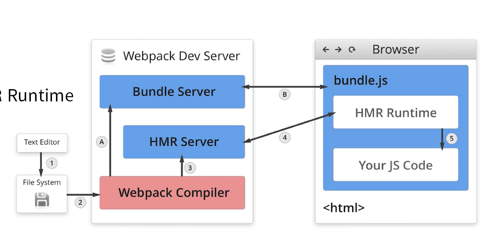

# --watch 文件监听的原理分析

轮询判断文件的最后编辑时间是否变化

某个文件发生了变化，并不会立即告诉监听者，而是先缓存起来，等aggregateTimeout

```javascript
module.export = {
    watch: true // 默认fasle，也就是不开启
    watchOptions: {
    	ignored: /node_modules/,
    	// 默认为空，不见听的文件或者文件夹，支持正则匹配
    	aggregateTimeout: 300, 
    	// 监听到变化后会等300ms再去执行，默认300ms
    	poll: 1000
    	// 判断文件是否变化是通过不停询问系统指定文件有没有变化实现的，默认每秒问1次
	}
}
```


# 热更新的原理分析

webpack complie：将js编译成bundle

HMR Server：将热更新的文件输出到HMR Runtime

Bundle server： 提供文件在浏览器的访问

HMR Runtime：会注入到浏览器，更新文件的变化

bundle.js： 构建输出的文件



# 文件指纹如何生产

1. hash，和整个项目的构建相关，只有项目文件有修改，整个项目构建的hash值就会变更
2. chunkhash，和webpack打包的chunk有关，不同的entry会生成不同的chunkhash值
3. contenthash，根据文件内容来定义hash，文件内容不变，则contenthash不变

# 静态资源内联

raw-loader内联html

```html
${require('raw-loader!babel-loader!./meta.html')}
```

raw-loader内联js

```html
<script>${require('raw-loader!babel-loader!../node_modules/lib-flexible')}</script>
```

 # source map

[JavaScript Source Map 详解 - 阮一峰的网络日志 (ruanyifeng.com)](http://www.ruanyifeng.com/blog/2013/01/javascript_source_map.html)

能不能服务器不放置，将map文件放错误检测系统。


# tree shaking 原理

概念：1个模块可能有多个方法，只要其中的某个方法使用到了，那么整个文件都会被打到bundle里面去，tree shaking就是只把用到的方法打入到bundle，没用到的在uglify阶段擦除掉

要求：必须是ES6的语法，CJS的方法不支持

### 利用ES6模块的特点

 * 只能作为模块顶层的语句出现
 * import的模块名只能是字符串常量
 * import binding的immutable的

### DCE(Elimination)

 	* 代码不会被执行，不可到达
 	* 代码执行的结果不会被用到
 	* 代码只会影响死变量（只写不读）

